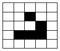
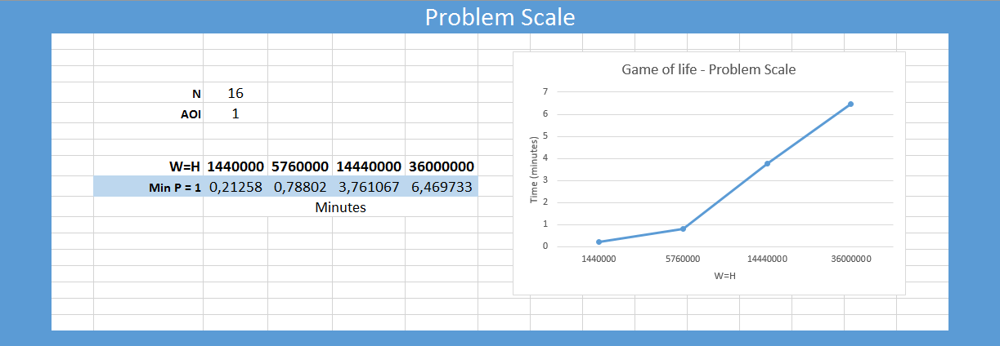
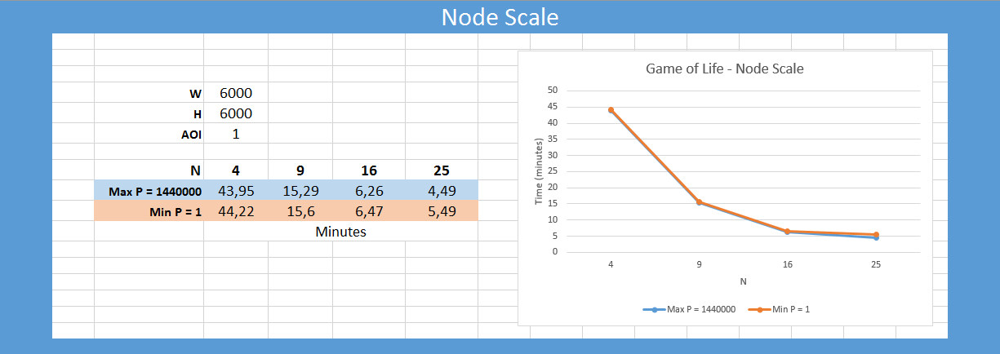
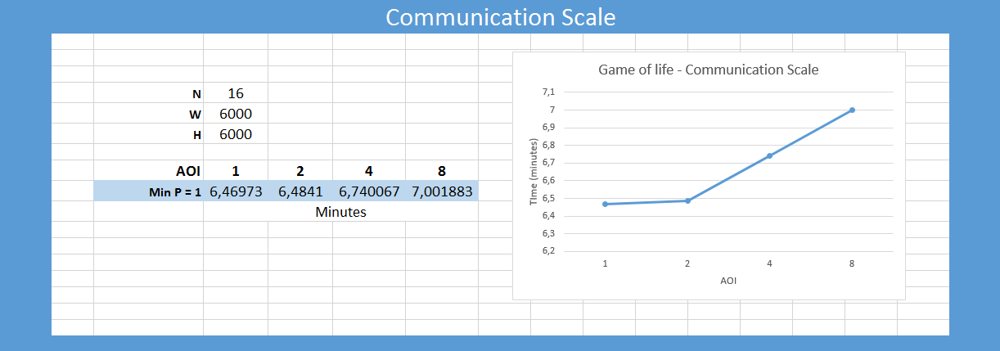

<!--
title: Gome Of Life
layout: default
authors: Gennaro Cordasco, Carmine Spagnuolo and Vittorio Scaran
-->

# Game Of Life Model Overview

The Game of Life, also known simply as Life, is a cellular automaton devised by the British mathematician John Horton Conway in 1970.
	

The _game_ is a zero-player game, meaning that its evolution is determined by its initial state, requiring no further input. One interacts with the Game of Life by creating an initial configuration and observing how it evolves or, for advanced players, by creating patterns with particular properties.

## Model Description

The universe of the Game of Life is an infinite two-dimensional orthogonal grid of square cells, each of which is in one of two possible states, alive or dead. Every cell interacts with its eight neighbours, which are the cells that are horizontally, vertically, or diagonally adjacent. At each step in time, the following transitions occur:

- Any live cell with fewer than two live neighbours dies, as if caused by under-population.
- Any live cell with two or three live neighbours lives on to the next generation.
- Any live cell with more than three live neighbours dies, as if by over-population.
- Any dead cell with exactly three live neighbours becomes a live cell, as if by reproduction.

The initial pattern constitutes the seed of the system. The first generation is created by applying the above rules simultaneously to every cell in the seed—births and deaths occur simultaneously, and the discrete moment at which this happens is sometimes called a tick (in other words, each generation is a pure function of the preceding one). The rules continue to be applied repeatedly to create further generations.

####References:
* [Game of Life - Wikipedia](https://en.wikipedia.org/wiki/Conway%27s_Game_of_Life)

### Why this model?

As described above, the game is completely deterministic and embarrassingly parallelizable (the behavior of a cell depends only on the neighboring cells). Behind deterministic this model is extremely helpful as test for parallel or distributed implementations of ABM on a 2D field (it allows to check.that the synchronization among the Logical Processors (LPs)  does not affect the behavior of the model). 

## Initial Conditions

The initial conditions of the GOL model is a matrix of 0 (dead cell) and 1 (alive cell), for instance the Glider wrapped by a frame of dead cells, shown in following picture:

 

continuously moves in south-east direction. 

## Model Parameters

| Parameter  | Description   |
|---|---|
| _**W**_  		| the width of the matrix field|
| _**H**_ 		| the height of the matrix field|
| _**S**_ 		| number of discrete steps to be performed|
| _**P**_		| density of matrix, number of patterns (showed above)|
| _**N**_		| numbers of workers|
| _**AOI**_		| area of interest for each agent|
| _**I**_| initial configuration matrix, the starting configuration is a matrix of 0 and 1, where 0 is dead cell and 1 is alife cell|
| _**F**_| final configuration matrix, the ending configuration is a matrix of 0 and 1, where 0 is dead cell and 1 is alife cell|

## Suggested Benchmark

By construction the glider assumes the same shape each four steps, but moves of one cell in south-east direction. 
Hence at the end of `100` time step the bottom-right of the glider, in the initial configuration as shown above in the pattern, reaches the position (29,29) .

| Benchmark Name  | Description   | Parameter Values |
|---|---|---|
| Problem scale | This benchmark will test the simulators ability to handle greater problem size. | _**W**_ϵ{`1200`, `2400`, `4800`, `6000`}, _**H**_=_**W**_, _**S**_= `100`, _**N**_=`16`=`4*4`, _**AOI**_=`1`, _**ρ**_=`1`, _**I**_= a single pattern positioned on the top-left of the field, _**F**_= a single glider, in the initial configuration as shown above in the pattern, whose bottom-right is on position (29,29)|
| Node scale | Benchmark to test the increasing number of processors on a fixed model size. This benchmark tests the scalability of a particular simulator and is not suitable for evaluation between simulators. | _**N**_ϵ{`4`, `9`, `16`, `25`}, _**H**_=_**W**_=`6000`, _**S**_= `100`, _**AOI**_=`1`, _**ρ**_ϵ{`1`, `1440000`}, _**I**_= a single pattern positioned on the top-left of the field for ρ=`1` and matrix filled by pattern for ρ=`1440000`, _**F**_= a single glider, in the initial configuration as shown above in the pattern, whose bottom-right is on position (29,29) for ρ=`1` and matrix filled by pattern for ρ=`1440000` exactly as in the initial configuration|
| Communication scale | This benchmark will test the simulators ability to handle increasing communication between agents given a fixed problem size and fixed number of processors, by increasing the size of each agents neighbourhood. | _**AOI**_ϵ{`1`, `2`, `4`, `8`}, _**H**_=_**W**_=`6000`, _**S**_= `100`, _**N**_=`16`=`4*4`, _**ρ**_=`1`, _**I**_= a single pattern positioned on the top-left of the field, _**F**_= a single glider, in the initial configuration as shown above in the pattern, whose bottom-right is on position (29,29)|

## Hardware configuration

Simulations are executed on a cluster with 16 nodes. Each node has the following hardware configuration: 
* CPU : 2xIntel(R) Xeon(R) CPU E5-2680 @ 2.70GHz(#core 16, #threads 32)
* RAM : 256GB 
* Network : adapter Intel Corporation I350 Gigabit

## Results

 

 

 

## Benchmark Authors

- NAME - ROLE - EMAIL
- 
GRAZIE
